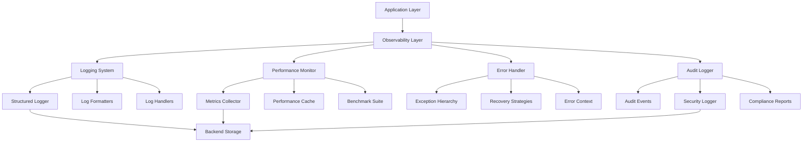
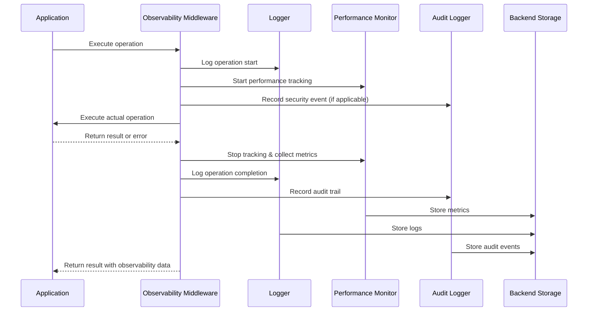

# Design Document: Observability and Performance Improvements

## Overview

This feature enhances the Deep Agents framework with comprehensive observability, performance monitoring, and improved error handling capabilities. The improvements address current gaps in structured logging, performance benchmarking, error diagnostics, and security auditing across all packages (deepagents SDK, CLI, ACP, and harbor). The design introduces a unified logging system, performance monitoring infrastructure, enhanced error handling with recovery mechanisms, security audit logging, and improved developer documentation.

## Architecture

The observability and performance improvements are implemented as cross-cutting concerns that integrate with existing middleware and backend systems. The architecture follows a layered approach with minimal invasiveness to existing code.



## Main Algorithm/Workflow




## Components and Interfaces

### Component 1: Structured Logging System

**Purpose**: Provide unified, structured logging across all Deep Agents packages with support for multiple output formats, log levels, and contextual information.

**Interface**:
```python
from typing import Any, Literal
from dataclasses import dataclass

LogLevel = Literal["DEBUG", "INFO", "WARNING", "ERROR", "CRITICAL"]
LogFormat = Literal["rich", "json", "plain"]

@dataclass
class LogConfig:
    """Configuration for the logging system."""
    level: LogLevel = "INFO"
    format: LogFormat = "rich"
    show_timestamp: bool = True
    show_module: bool = True
    file_path: str | None = None
    file_max_bytes: int = 10_485_760  # 10MB
    file_backup_count: int = 5
    quiet_loggers: list[str] = None

class StructuredLogger:
    """Structured logger with context support."""

    def debug(self, msg: str, **context: Any) -> None:
        """Log debug message with context."""
        ...

    def info(self, msg: str, **context: Any) -> None:
        """Log info message with context."""
        ...

    def warning(self, msg: str, **context: Any) -> None:
        """Log warning message with context."""
        ...

    def error(self, msg: str, exc_info: Exception | None = None, **context: Any) -> None:
        """Log error message with exception and context."""
        ...

    def critical(self, msg: str, exc_info: Exception | None = None, **context: Any) -> None:
        """Log critical message with exception and context."""
        ...

    def with_context(self, **context: Any) -> "StructuredLogger":
        """Create a child logger with additional context."""
        ...

def setup_logging(config: LogConfig) -> StructuredLogger:
    """Initialize the logging system with the given configuration."""
    ...

def get_logger(name: str) -> StructuredLogger:
    """Get a logger instance for the given module name."""
    ...
```

**Responsibilities**:
- Configure logging system at application startup
- Provide structured logging with contextual information
- Support multiple output formats (rich console, JSON, plain text)
- Handle log rotation and file management
- Quiet noisy third-party loggers

### Component 2: Performance Monitoring System

**Purpose**: Track and analyze performance metrics for file operations, LLM calls, and agent execution with caching and benchmarking capabilities.

**Interface**:
```python
from typing import Protocol, TypeVar, Callable, Any
from dataclasses import dataclass
from datetime import datetime

T = TypeVar("T")

@dataclass
class PerformanceMetrics:
    """Performance metrics for an operation."""
    operation_name: str
    start_time: datetime
    end_time: datetime
    duration_ms: float
    memory_delta_mb: float
    tokens_used: int | None = None
    cache_hit: bool = False
    error: str | None = None
    metadata: dict[str, Any] | None = None

class PerformanceMonitor:
    """Monitor and track performance metrics."""

    def track_operation(
        self,
        operation_name: str,
        func: Callable[..., T],
        *args: Any,
        **kwargs: Any
    ) -> tuple[T, PerformanceMetrics]:
        """Track performance of a function execution."""
        ...

    def get_metrics(
        self,
        operation_name: str | None = None,
        start_time: datetime | None = None,
        end_time: datetime | None = None
    ) -> list[PerformanceMetrics]:
        """Retrieve performance metrics with optional filtering."""
        ...

    def get_summary(self, operation_name: str) -> dict[str, Any]:
        """Get summary statistics for an operation."""
        ...

class PerformanceCache:
    """LRU cache with performance tracking."""

    def get(self, key: str) -> Any | None:
        """Get cached value if available."""
        ...

    def set(self, key: str, value: Any, ttl_seconds: int | None = None) -> None:
        """Cache a value with optional TTL."""
        ...

    def invalidate(self, key: str) -> None:
        """Invalidate a cached value."""
        ...

    def clear(self) -> None:
        """Clear all cached values."""
        ...

    def get_stats(self) -> dict[str, Any]:
        """Get cache statistics (hit rate, size, etc.)."""
        ...
```

**Responsibilities**:
- Track execution time and memory usage for operations
- Provide caching layer for expensive operations
- Collect and aggregate performance metrics
- Generate performance summaries and reports
- Support benchmarking and performance testing


### Component 3: Enhanced Error Handling System

**Purpose**: Provide fine-grained exception hierarchy, error recovery mechanisms, and rich error context for better diagnostics and system stability.

**Interface**:
```python
from typing import Any, Callable, TypeVar
from dataclasses import dataclass
from enum import Enum

T = TypeVar("T")

class ErrorSeverity(Enum):
    """Severity levels for errors."""
    LOW = "low"
    MEDIUM = "medium"
    HIGH = "high"
    CRITICAL = "critical"

@dataclass
class ErrorContext:
    """Rich context information for errors."""
    operation: str
    component: str
    user_message: str
    technical_details: dict[str, Any]
    severity: ErrorSeverity
    recoverable: bool
    suggested_actions: list[str]
    related_errors: list[Exception] | None = None

class DeepAgentsError(Exception):
    """Base exception for all Deep Agents errors."""

    def __init__(
        self,
        message: str,
        *,
        context: ErrorContext | None = None,
        cause: Exception | None = None
    ) -> None:
        """Initialize error with message and optional context."""
        ...

    @property
    def context(self) -> ErrorContext | None:
        """Get error context if available."""
        ...

    def to_dict(self) -> dict[str, Any]:
        """Convert error to dictionary for logging/serialization."""
        ...

class BackendError(DeepAgentsError):
    """Errors related to backend operations."""
    ...

class FileOperationError(BackendError):
    """Errors during file operations."""
    ...

class ExecutionError(BackendError):
    """Errors during command execution."""
    ...

class MiddlewareError(DeepAgentsError):
    """Errors in middleware processing."""
    ...

class ModelError(DeepAgentsError):
    """Errors related to LLM model operations."""
    ...

class ValidationError(DeepAgentsError):
    """Errors during input validation."""
    ...

class RecoveryStrategy(Protocol):
    """Protocol for error recovery strategies."""

    def can_recover(self, error: Exception) -> bool:
        """Check if this strategy can recover from the error."""
        ...

    def recover(self, error: Exception, context: dict[str, Any]) -> Any:
        """Attempt to recover from the error."""
        ...

class ErrorHandler:
    """Centralized error handling with recovery strategies."""

    def register_strategy(
        self,
        error_type: type[Exception],
        strategy: RecoveryStrategy
    ) -> None:
        """Register a recovery strategy for an error type."""
        ...

    def handle_error(
        self,
        error: Exception,
        context: dict[str, Any] | None = None,
        *,
        raise_on_failure: bool = True
    ) -> Any:
        """Handle an error with registered recovery strategies."""
        ...

    def with_recovery(
        self,
        func: Callable[..., T],
        *args: Any,
        **kwargs: Any
    ) -> T:
        """Execute function with automatic error recovery."""
        ...
```

**Responsibilities**:
- Define fine-grained exception hierarchy
- Capture rich error context for diagnostics
- Implement error recovery strategies
- Provide user-friendly error messages
- Track error patterns and frequencies


### Component 4: Security Audit Logging System

**Purpose**: Record security-sensitive operations for compliance, forensics, and security monitoring.

**Interface**:
```python
from typing import Any, Literal
from dataclasses import dataclass
from datetime import datetime
from enum import Enum

class AuditEventType(Enum):
    """Types of auditable events."""
    FILE_READ = "file_read"
    FILE_WRITE = "file_write"
    FILE_DELETE = "file_delete"
    COMMAND_EXECUTION = "command_execution"
    MODEL_INVOCATION = "model_invocation"
    AUTHENTICATION = "authentication"
    AUTHORIZATION = "authorization"
    CONFIGURATION_CHANGE = "configuration_change"
    DATA_ACCESS = "data_access"

@dataclass
class AuditEvent:
    """Security audit event record."""
    event_id: str
    event_type: AuditEventType
    timestamp: datetime
    user_id: str | None
    session_id: str | None
    component: str
    action: str
    resource: str | None
    result: Literal["success", "failure", "denied"]
    metadata: dict[str, Any]
    risk_level: Literal["low", "medium", "high", "critical"]

class AuditLogger:
    """Security audit logging system."""

    def log_event(
        self,
        event_type: AuditEventType,
        action: str,
        *,
        resource: str | None = None,
        result: Literal["success", "failure", "denied"] = "success",
        risk_level: Literal["low", "medium", "high", "critical"] = "low",
        **metadata: Any
    ) -> str:
        """Log a security audit event."""
        ...

    def log_file_operation(
        self,
        operation: Literal["read", "write", "delete"],
        file_path: str,
        *,
        result: Literal["success", "failure", "denied"] = "success",
        **metadata: Any
    ) -> str:
        """Log a file operation audit event."""
        ...

    def log_command_execution(
        self,
        command: str,
        *,
        result: Literal["success", "failure", "denied"] = "success",
        exit_code: int | None = None,
        **metadata: Any
    ) -> str:
        """Log a command execution audit event."""
        ...

    def query_events(
        self,
        *,
        event_type: AuditEventType | None = None,
        start_time: datetime | None = None,
        end_time: datetime | None = None,
        user_id: str | None = None,
        risk_level: Literal["low", "medium", "high", "critical"] | None = None
    ) -> list[AuditEvent]:
        """Query audit events with filters."""
        ...

    def generate_report(
        self,
        start_time: datetime,
        end_time: datetime,
        *,
        format: Literal["json", "csv", "html"] = "json"
    ) -> str:
        """Generate audit report for a time period."""
        ...

def get_audit_logger() -> AuditLogger:
    """Get the global audit logger instance."""
    ...
```

**Responsibilities**:
- Record all security-sensitive operations
- Track file access and modifications
- Log command executions with context
- Support compliance reporting
- Enable forensic analysis

### Component 5: Observability Middleware

**Purpose**: Integrate observability features into the Deep Agents middleware stack with minimal code changes.

**Interface**:
```python
from typing import Any
from langchain.agents.middleware.types import AgentMiddleware
from langgraph.types import Command

class ObservabilityMiddleware(AgentMiddleware):
    """Middleware for observability integration."""

    def __init__(
        self,
        *,
        enable_logging: bool = True,
        enable_performance: bool = True,
        enable_audit: bool = True,
        log_level: str = "INFO",
        track_token_usage: bool = True
    ) -> None:
        """Initialize observability middleware.

        Args:
            enable_logging: Enable structured logging.
            enable_performance: Enable performance tracking.
            enable_audit: Enable security audit logging.
            log_level: Logging level for this middleware.
            track_token_usage: Track LLM token usage.
        """
        ...

    async def __call__(
        self,
        state: dict[str, Any],
        call_next: Any
    ) -> Command | dict[str, Any]:
        """Process state with observability tracking."""
        ...

class PerformanceMiddleware(AgentMiddleware):
    """Middleware specifically for performance monitoring."""

    def __init__(
        self,
        *,
        enable_cache: bool = True,
        cache_ttl_seconds: int = 3600,
        track_memory: bool = True
    ) -> None:
        """Initialize performance middleware.

        Args:
            enable_cache: Enable performance caching.
            cache_ttl_seconds: Cache TTL in seconds.
            track_memory: Track memory usage.
        """
        ...

    async def __call__(
        self,
        state: dict[str, Any],
        call_next: Any
    ) -> Command | dict[str, Any]:
        """Process state with performance tracking."""
        ...
```

**Responsibilities**:
- Integrate observability into middleware stack
- Track operations transparently
- Collect metrics without code changes
- Support configuration via middleware parameters
- Maintain backward compatibility


## Data Models

### Model 1: LogRecord

```python
from typing import Any, Literal
from dataclasses import dataclass, field
from datetime import datetime

@dataclass
class LogRecord:
    """Structured log record."""
    timestamp: datetime
    level: Literal["DEBUG", "INFO", "WARNING", "ERROR", "CRITICAL"]
    logger_name: str
    message: str
    context: dict[str, Any] = field(default_factory=dict)
    exception: Exception | None = None
    stack_trace: str | None = None
    thread_id: int | None = None
    process_id: int | None = None
```

**Validation Rules**:
- `timestamp` must be a valid datetime
- `level` must be one of the defined log levels
- `logger_name` must be non-empty string
- `message` must be non-empty string
- `context` must be JSON-serializable

### Model 2: PerformanceMetrics

```python
from typing import Any
from dataclasses import dataclass, field
from datetime import datetime

@dataclass
class PerformanceMetrics:
    """Performance metrics for an operation."""
    operation_name: str
    start_time: datetime
    end_time: datetime
    duration_ms: float
    memory_delta_mb: float
    tokens_used: int | None = None
    cache_hit: bool = False
    error: str | None = None
    metadata: dict[str, Any] = field(default_factory=dict)

    @property
    def duration_seconds(self) -> float:
        """Get duration in seconds."""
        return self.duration_ms / 1000.0

    def to_dict(self) -> dict[str, Any]:
        """Convert to dictionary for serialization."""
        return {
            "operation_name": self.operation_name,
            "start_time": self.start_time.isoformat(),
            "end_time": self.end_time.isoformat(),
            "duration_ms": self.duration_ms,
            "memory_delta_mb": self.memory_delta_mb,
            "tokens_used": self.tokens_used,
            "cache_hit": self.cache_hit,
            "error": self.error,
            "metadata": self.metadata,
        }
```

**Validation Rules**:
- `operation_name` must be non-empty string
- `start_time` must be before or equal to `end_time`
- `duration_ms` must be non-negative
- `memory_delta_mb` can be negative (memory freed)
- `tokens_used` must be non-negative if provided

### Model 3: AuditEvent

```python
from typing import Any, Literal
from dataclasses import dataclass, field
from datetime import datetime
from enum import Enum
import uuid

class AuditEventType(Enum):
    """Types of auditable events."""
    FILE_READ = "file_read"
    FILE_WRITE = "file_write"
    FILE_DELETE = "file_delete"
    COMMAND_EXECUTION = "command_execution"
    MODEL_INVOCATION = "model_invocation"
    AUTHENTICATION = "authentication"
    AUTHORIZATION = "authorization"
    CONFIGURATION_CHANGE = "configuration_change"
    DATA_ACCESS = "data_access"

@dataclass
class AuditEvent:
    """Security audit event record."""
    event_id: str = field(default_factory=lambda: str(uuid.uuid4()))
    event_type: AuditEventType = AuditEventType.DATA_ACCESS
    timestamp: datetime = field(default_factory=datetime.now)
    user_id: str | None = None
    session_id: str | None = None
    component: str = ""
    action: str = ""
    resource: str | None = None
    result: Literal["success", "failure", "denied"] = "success"
    metadata: dict[str, Any] = field(default_factory=dict)
    risk_level: Literal["low", "medium", "high", "critical"] = "low"

    def to_dict(self) -> dict[str, Any]:
        """Convert to dictionary for serialization."""
        return {
            "event_id": self.event_id,
            "event_type": self.event_type.value,
            "timestamp": self.timestamp.isoformat(),
            "user_id": self.user_id,
            "session_id": self.session_id,
            "component": self.component,
            "action": self.action,
            "resource": self.resource,
            "result": self.result,
            "metadata": self.metadata,
            "risk_level": self.risk_level,
        }
```

**Validation Rules**:
- `event_id` must be a valid UUID string
- `event_type` must be a valid AuditEventType enum value
- `timestamp` must be a valid datetime
- `component` must be non-empty string
- `action` must be non-empty string
- `result` must be one of: "success", "failure", "denied"
- `risk_level` must be one of: "low", "medium", "high", "critical"
- `metadata` must be JSON-serializable


## Key Functions with Formal Specifications

### Function 1: setup_logging()

```python
def setup_logging(config: LogConfig) -> StructuredLogger:
    """Initialize the logging system with the given configuration.

    Args:
        config: Logging configuration.

    Returns:
        Configured root logger instance.
    """
```

**Preconditions:**
- `config` is a valid LogConfig instance
- `config.level` is a valid log level string
- `config.format` is a valid format string
- If `config.file_path` is provided, parent directory must be writable

**Postconditions:**
- Returns a configured StructuredLogger instance
- Root logger is configured with specified level and format
- Console handler is attached to root logger
- If `config.file_path` is provided, file handler is attached
- Quiet loggers are set to WARNING level
- Logging system is ready for use across all modules

**Loop Invariants:** N/A (no loops in function)

### Function 2: track_operation()

```python
def track_operation(
    self,
    operation_name: str,
    func: Callable[..., T],
    *args: Any,
    **kwargs: Any
) -> tuple[T, PerformanceMetrics]:
    """Track performance of a function execution.

    Args:
        operation_name: Name of the operation being tracked.
        func: Function to execute and track.
        args: Positional arguments for func.
        kwargs: Keyword arguments for func.

    Returns:
        Tuple of (function result, performance metrics).
    """
```

**Preconditions:**
- `operation_name` is non-empty string
- `func` is a callable object
- Performance monitor is initialized

**Postconditions:**
- Returns tuple containing function result and PerformanceMetrics
- `func` is executed exactly once with provided args/kwargs
- Performance metrics capture start time, end time, and duration
- Memory delta is calculated (may be negative if memory freed)
- If `func` raises exception, metrics contain error information
- Metrics are stored in performance monitor's history

**Loop Invariants:** N/A (no loops in function)

### Function 3: log_audit_event()

```python
def log_event(
    self,
    event_type: AuditEventType,
    action: str,
    *,
    resource: str | None = None,
    result: Literal["success", "failure", "denied"] = "success",
    risk_level: Literal["low", "medium", "high", "critical"] = "low",
    **metadata: Any
) -> str:
    """Log a security audit event.

    Args:
        event_type: Type of audit event.
        action: Action being performed.
        resource: Resource being accessed (optional).
        result: Result of the action.
        risk_level: Risk level of the event.
        metadata: Additional metadata for the event.

    Returns:
        Event ID of the logged audit event.
    """
```

**Preconditions:**
- `event_type` is a valid AuditEventType enum value
- `action` is non-empty string
- `result` is one of: "success", "failure", "denied"
- `risk_level` is one of: "low", "medium", "high", "critical"
- `metadata` values are JSON-serializable
- Audit logger is initialized

**Postconditions:**
- Returns unique event ID (UUID string)
- AuditEvent is created with all provided information
- Event is persisted to audit log storage
- Event timestamp is set to current time
- Event includes current user_id and session_id if available
- High/critical risk events trigger immediate flush to storage

**Loop Invariants:** N/A (no loops in function)


## Algorithmic Pseudocode

### Main Observability Workflow

```python
# Algorithm: Process operation with full observability
# Input: operation_name (str), operation_func (Callable), args, kwargs
# Output: operation result with observability data

def process_with_observability(
    operation_name: str,
    operation_func: Callable[..., T],
    *args: Any,
    **kwargs: Any
) -> T:
    """Execute operation with full observability tracking."""

    # Precondition: operation_name is non-empty
    assert operation_name and isinstance(operation_name, str)

    # Step 1: Initialize observability context
    logger = get_logger(__name__)
    perf_monitor = get_performance_monitor()
    audit_logger = get_audit_logger()
    error_handler = get_error_handler()

    # Step 2: Log operation start
    logger.info(
        f"Starting operation: {operation_name}",
        operation=operation_name,
        args_count=len(args),
        kwargs_keys=list(kwargs.keys())
    )

    # Step 3: Start performance tracking
    start_time = datetime.now()
    start_memory = get_current_memory_mb()

    # Step 4: Log audit event if security-sensitive
    if is_security_sensitive(operation_name):
        audit_logger.log_event(
            event_type=determine_event_type(operation_name),
            action=operation_name,
            resource=extract_resource(args, kwargs),
            risk_level=determine_risk_level(operation_name)
        )

    result = None
    error = None

    try:
        # Step 5: Execute operation with error handling
        result = error_handler.with_recovery(
            operation_func,
            *args,
            **kwargs
        )

        # Step 6: Log successful completion
        logger.info(
            f"Operation completed: {operation_name}",
            operation=operation_name,
            success=True
        )

    except Exception as e:
        # Step 7: Handle and log errors
        error = e
        logger.error(
            f"Operation failed: {operation_name}",
            exc_info=e,
            operation=operation_name,
            error_type=type(e).__name__
        )

        # Log audit event for failure
        if is_security_sensitive(operation_name):
            audit_logger.log_event(
                event_type=determine_event_type(operation_name),
                action=operation_name,
                result="failure",
                risk_level="high",
                error=str(e)
            )

        raise

    finally:
        # Step 8: Collect and store performance metrics
        end_time = datetime.now()
        end_memory = get_current_memory_mb()

        metrics = PerformanceMetrics(
            operation_name=operation_name,
            start_time=start_time,
            end_time=end_time,
            duration_ms=(end_time - start_time).total_seconds() * 1000,
            memory_delta_mb=end_memory - start_memory,
            error=str(error) if error else None
        )

        perf_monitor.store_metrics(metrics)

        # Step 9: Log performance summary
        logger.debug(
            f"Performance: {operation_name}",
            operation=operation_name,
            duration_ms=metrics.duration_ms,
            memory_delta_mb=metrics.memory_delta_mb
        )

    # Postcondition: result is returned or exception is raised
    return result
```

**Preconditions:**
- `operation_name` is non-empty string
- `operation_func` is callable
- Observability system is initialized

**Postconditions:**
- Operation is executed exactly once
- All observability data is collected and stored
- Logs are written for start, completion/failure, and performance
- Audit events are logged for security-sensitive operations
- Performance metrics are stored
- Original result is returned or exception is propagated

**Loop Invariants:** N/A (no loops in algorithm)

### Performance Caching Algorithm

```python
# Algorithm: Cache-aware operation execution
# Input: cache_key (str), operation_func (Callable), ttl_seconds (int)
# Output: cached or computed result

def execute_with_cache(
    cache_key: str,
    operation_func: Callable[..., T],
    ttl_seconds: int = 3600,
    *args: Any,
    **kwargs: Any
) -> T:
    """Execute operation with caching support."""

    # Precondition: cache_key is non-empty
    assert cache_key and isinstance(cache_key, str)
    assert ttl_seconds > 0

    cache = get_performance_cache()
    logger = get_logger(__name__)

    # Step 1: Check cache for existing value
    cached_value = cache.get(cache_key)

    if cached_value is not None:
        # Step 2: Cache hit - return cached value
        logger.debug(
            "Cache hit",
            cache_key=cache_key,
            cache_hit=True
        )
        return cached_value

    # Step 3: Cache miss - execute operation
    logger.debug(
        "Cache miss",
        cache_key=cache_key,
        cache_hit=False
    )

    result = operation_func(*args, **kwargs)

    # Step 4: Store result in cache
    cache.set(cache_key, result, ttl_seconds=ttl_seconds)

    logger.debug(
        "Cached result",
        cache_key=cache_key,
        ttl_seconds=ttl_seconds
    )

    # Postcondition: result is cached and returned
    return result
```

**Preconditions:**
- `cache_key` is non-empty string
- `operation_func` is callable
- `ttl_seconds` is positive integer
- Performance cache is initialized

**Postconditions:**
- If cache hit: cached value is returned without executing operation_func
- If cache miss: operation_func is executed and result is cached
- Cache entry has TTL of ttl_seconds
- Result is returned
- Cache statistics are updated

**Loop Invariants:** N/A (no loops in algorithm)


### Error Recovery Algorithm

```python
# Algorithm: Error handling with recovery strategies
# Input: error (Exception), context (dict), strategies (list[RecoveryStrategy])
# Output: recovered result or re-raised exception

def handle_error_with_recovery(
    error: Exception,
    context: dict[str, Any],
    strategies: list[RecoveryStrategy]
) -> Any:
    """Attempt to recover from error using registered strategies."""

    # Precondition: error is an Exception instance
    assert isinstance(error, Exception)
    assert isinstance(strategies, list)

    logger = get_logger(__name__)

    # Step 1: Log error occurrence
    logger.error(
        "Error occurred, attempting recovery",
        error_type=type(error).__name__,
        error_message=str(error),
        context=context
    )

    # Step 2: Try each recovery strategy in order
    for strategy in strategies:
        # Loop invariant: All previous strategies failed to recover

        if not strategy.can_recover(error):
            logger.debug(
                "Strategy cannot recover from error",
                strategy=type(strategy).__name__,
                error_type=type(error).__name__
            )
            continue

        try:
            # Step 3: Attempt recovery
            logger.info(
                "Attempting recovery",
                strategy=type(strategy).__name__,
                error_type=type(error).__name__
            )

            result = strategy.recover(error, context)

            # Step 4: Recovery successful
            logger.info(
                "Recovery successful",
                strategy=type(strategy).__name__,
                error_type=type(error).__name__
            )

            return result

        except Exception as recovery_error:
            # Step 5: Recovery failed, try next strategy
            logger.warning(
                "Recovery failed",
                strategy=type(strategy).__name__,
                error_type=type(error).__name__,
                recovery_error=str(recovery_error)
            )
            continue

    # Step 6: All recovery strategies failed
    logger.error(
        "All recovery strategies failed",
        error_type=type(error).__name__,
        strategies_tried=len(strategies)
    )

    # Postcondition: Either recovered result is returned or original error is raised
    raise error
```

**Preconditions:**
- `error` is an Exception instance
- `context` is a dictionary
- `strategies` is a list of RecoveryStrategy instances
- Logger is initialized

**Postconditions:**
- If any strategy succeeds: recovered result is returned
- If all strategies fail: original error is re-raised
- All recovery attempts are logged
- Successful recovery is logged with strategy name

**Loop Invariants:**
- All previously tried strategies failed to recover
- Original error is preserved throughout iteration
- Each strategy is tried at most once


## Example Usage

### Example 1: Basic Logging Setup

```python
from deepagents.observability import setup_logging, get_logger, LogConfig

# Configure logging at application startup
config = LogConfig(
    level="INFO",
    format="rich",
    show_timestamp=True,
    show_module=True,
    file_path="logs/deepagents.log",
    file_max_bytes=10_485_760,  # 10MB
    file_backup_count=5
)

setup_logging(config)

# Use logger in any module
logger = get_logger(__name__)

logger.info("Agent started", agent_id="agent-123", model="claude-sonnet-4")
logger.debug("Processing request", request_id="req-456", user_id="user-789")
logger.error("Operation failed", exc_info=exception, operation="file_write")
```

### Example 2: Performance Monitoring

```python
from deepagents.observability import get_performance_monitor, PerformanceMetrics

perf_monitor = get_performance_monitor()

# Track a function execution
def expensive_operation(data: list[str]) -> dict[str, Any]:
    # ... complex processing ...
    return result

result, metrics = perf_monitor.track_operation(
    "data_processing",
    expensive_operation,
    data=large_dataset
)

print(f"Duration: {metrics.duration_ms}ms")
print(f"Memory delta: {metrics.memory_delta_mb}MB")

# Get performance summary
summary = perf_monitor.get_summary("data_processing")
print(f"Average duration: {summary['avg_duration_ms']}ms")
print(f"Total calls: {summary['total_calls']}")
```

### Example 3: Performance Caching

```python
from deepagents.observability import get_performance_cache

cache = get_performance_cache()

# Cache expensive LLM calls
def generate_summary(text: str) -> str:
    cache_key = f"summary:{hash(text)}"

    cached = cache.get(cache_key)
    if cached:
        return cached

    # Expensive LLM call
    summary = llm.invoke(f"Summarize: {text}")

    # Cache for 1 hour
    cache.set(cache_key, summary, ttl_seconds=3600)

    return summary

# Check cache statistics
stats = cache.get_stats()
print(f"Hit rate: {stats['hit_rate']:.2%}")
print(f"Cache size: {stats['size']} entries")
```

### Example 4: Enhanced Error Handling

```python
from deepagents.observability import (
    DeepAgentsError,
    FileOperationError,
    ErrorContext,
    ErrorSeverity,
    get_error_handler
)

# Raise error with rich context
def read_config_file(path: str) -> dict[str, Any]:
    try:
        with open(path) as f:
            return json.load(f)
    except FileNotFoundError as e:
        context = ErrorContext(
            operation="read_config",
            component="config_loader",
            user_message="Configuration file not found",
            technical_details={"path": path, "cwd": os.getcwd()},
            severity=ErrorSeverity.HIGH,
            recoverable=True,
            suggested_actions=[
                "Check if the file path is correct",
                "Ensure the file exists",
                "Use default configuration"
            ]
        )
        raise FileOperationError(
            f"Failed to read config file: {path}",
            context=context,
            cause=e
        )

# Use error handler with recovery
error_handler = get_error_handler()

# Register recovery strategy
class DefaultConfigRecovery:
    def can_recover(self, error: Exception) -> bool:
        return isinstance(error, FileOperationError)

    def recover(self, error: Exception, context: dict[str, Any]) -> dict[str, Any]:
        return {"default": "config"}

error_handler.register_strategy(FileOperationError, DefaultConfigRecovery())

# Execute with automatic recovery
config = error_handler.with_recovery(
    read_config_file,
    "config.json"
)
```

### Example 5: Security Audit Logging

```python
from deepagents.observability import get_audit_logger, AuditEventType

audit_logger = get_audit_logger()

# Log file operations
def write_sensitive_file(path: str, content: str) -> None:
    try:
        with open(path, 'w') as f:
            f.write(content)

        # Log successful write
        audit_logger.log_file_operation(
            operation="write",
            file_path=path,
            result="success",
            risk_level="high",
            content_size=len(content),
            user_action="manual_edit"
        )
    except Exception as e:
        # Log failed write
        audit_logger.log_file_operation(
            operation="write",
            file_path=path,
            result="failure",
            risk_level="high",
            error=str(e)
        )
        raise

# Log command execution
def execute_shell_command(command: str) -> str:
    result = subprocess.run(command, shell=True, capture_output=True)

    audit_logger.log_command_execution(
        command=command,
        result="success" if result.returncode == 0 else "failure",
        exit_code=result.returncode,
        risk_level="critical" if "rm" in command else "medium"
    )

    return result.stdout.decode()

# Query audit events
events = audit_logger.query_events(
    event_type=AuditEventType.FILE_WRITE,
    risk_level="high",
    start_time=datetime.now() - timedelta(hours=24)
)

print(f"High-risk file writes in last 24h: {len(events)}")
```

### Example 6: Observability Middleware Integration

```python
from deepagents import create_deep_agent
from deepagents.observability import ObservabilityMiddleware, PerformanceMiddleware

# Create agent with observability middleware
agent = create_deep_agent(
    model="claude-sonnet-4",
    middleware=[
        ObservabilityMiddleware(
            enable_logging=True,
            enable_performance=True,
            enable_audit=True,
            log_level="INFO",
            track_token_usage=True
        ),
        PerformanceMiddleware(
            enable_cache=True,
            cache_ttl_seconds=3600,
            track_memory=True
        ),
        # ... other middleware ...
    ]
)

# All operations are automatically tracked
result = agent.invoke({"messages": [{"role": "user", "content": "Hello"}]})

# Observability data is collected transparently
```


## Correctness Properties

### Universal Quantification Properties

1. **Logging Consistency**: ∀ log_record ∈ LogRecords: log_record.timestamp ≤ current_time ∧ log_record.level ∈ ValidLogLevels ∧ log_record.message ≠ ""

2. **Performance Metrics Validity**: ∀ metrics ∈ PerformanceMetrics: metrics.start_time ≤ metrics.end_time ∧ metrics.duration_ms ≥ 0 ∧ (metrics.tokens_used = None ∨ metrics.tokens_used ≥ 0)

3. **Audit Event Integrity**: ∀ event ∈ AuditEvents: event.event_id is unique ∧ event.timestamp ≤ current_time ∧ event.result ∈ {"success", "failure", "denied"} ∧ event.risk_level ∈ {"low", "medium", "high", "critical"}

4. **Error Context Completeness**: ∀ error ∈ DeepAgentsErrors: error.context ≠ None ⟹ (error.context.operation ≠ "" ∧ error.context.component ≠ "" ∧ error.context.user_message ≠ "")

5. **Cache Consistency**: ∀ cache_entry ∈ CacheEntries: (cache_entry.ttl ≠ None ∧ cache_entry.created_at + cache_entry.ttl < current_time) ⟹ cache_entry ∉ ActiveCache

6. **Recovery Strategy Determinism**: ∀ strategy ∈ RecoveryStrategies, ∀ error ∈ Exceptions: strategy.can_recover(error) = true ⟹ strategy.recover(error, context) does not raise the same error type

7. **Observability Non-Interference**: ∀ operation ∈ Operations: observability_wrapper(operation).result = operation.result ∨ observability_wrapper(operation) raises same exception as operation

8. **Audit Log Immutability**: ∀ event ∈ AuditEvents: once persisted, event cannot be modified or deleted

9. **Performance Tracking Completeness**: ∀ tracked_operation ∈ TrackedOperations: ∃ metrics ∈ PerformanceMetrics: metrics.operation_name = tracked_operation.name ∧ metrics.start_time ≤ metrics.end_time

10. **Log Level Hierarchy**: ∀ logger ∈ Loggers: logger.level = L ⟹ logger emits messages with level ≥ L

### Property-Based Test Assertions

```python
# Property 1: Log records are always well-formed
def test_log_record_validity(log_record: LogRecord) -> bool:
    """All log records must have valid structure."""
    return (
        log_record.timestamp <= datetime.now() and
        log_record.level in ["DEBUG", "INFO", "WARNING", "ERROR", "CRITICAL"] and
        len(log_record.message) > 0 and
        log_record.logger_name != "" and
        all(isinstance(k, str) for k in log_record.context.keys())
    )

# Property 2: Performance metrics duration matches time difference
def test_performance_metrics_duration(metrics: PerformanceMetrics) -> bool:
    """Duration must match the difference between start and end times."""
    expected_duration_ms = (metrics.end_time - metrics.start_time).total_seconds() * 1000
    tolerance_ms = 1.0  # Allow 1ms tolerance for floating point
    return abs(metrics.duration_ms - expected_duration_ms) <= tolerance_ms

# Property 3: Cache operations are idempotent
def test_cache_idempotency(cache: PerformanceCache, key: str, value: Any) -> bool:
    """Setting the same value twice should be idempotent."""
    cache.set(key, value)
    first_get = cache.get(key)
    cache.set(key, value)
    second_get = cache.get(key)
    return first_get == second_get == value

# Property 4: Error recovery never loses original error information
def test_error_recovery_preserves_info(
    error: Exception,
    handler: ErrorHandler
) -> bool:
    """Recovery attempts must preserve original error information."""
    try:
        handler.handle_error(error, raise_on_failure=True)
    except Exception as caught:
        # Either we get the original error or a wrapped version
        return caught is error or (
            hasattr(caught, '__cause__') and caught.__cause__ is error
        )
    return True  # Recovery succeeded

# Property 5: Audit events are strictly ordered by timestamp
def test_audit_events_ordering(events: list[AuditEvent]) -> bool:
    """Audit events must be ordered by timestamp."""
    for i in range(len(events) - 1):
        if events[i].timestamp > events[i + 1].timestamp:
            return False
    return True

# Property 6: Observability overhead is bounded
def test_observability_overhead(
    operation: Callable,
    max_overhead_percent: float = 10.0
) -> bool:
    """Observability should add less than 10% overhead."""
    # Measure without observability
    start = time.perf_counter()
    result_plain = operation()
    duration_plain = time.perf_counter() - start

    # Measure with observability
    start = time.perf_counter()
    result_observed, metrics = track_operation("test", operation)
    duration_observed = time.perf_counter() - start

    overhead_percent = ((duration_observed - duration_plain) / duration_plain) * 100
    return overhead_percent <= max_overhead_percent and result_plain == result_observed
```


## Error Handling

### Error Scenario 1: Log File Write Failure

**Condition**: File handler cannot write to log file due to permissions or disk space

**Response**:
- Fall back to console-only logging
- Emit warning to stderr about log file failure
- Continue operation without crashing
- Store error in internal error buffer

**Recovery**:
- Retry log file creation with exponential backoff
- If persistent failure, disable file logging for session
- Notify user through console output

### Error Scenario 2: Performance Metrics Storage Failure

**Condition**: Backend storage unavailable or full when storing metrics

**Response**:
- Buffer metrics in memory (up to 1000 entries)
- Log warning about storage failure
- Continue tracking new metrics
- Attempt to flush buffer periodically

**Recovery**:
- Retry storage with exponential backoff
- If buffer full, drop oldest metrics (FIFO)
- Persist critical metrics to local file as backup
- Resume normal operation when storage available

### Error Scenario 3: Audit Log Corruption

**Condition**: Audit log file is corrupted or unreadable

**Response**:
- Create new audit log file with timestamp suffix
- Log corruption event to new file
- Preserve corrupted file for forensics
- Continue audit logging to new file

**Recovery**:
- Attempt to recover readable entries from corrupted file
- Merge recovered entries into new log
- Alert administrator about corruption
- Implement checksum validation for future writes

### Error Scenario 4: Cache Eviction Under Memory Pressure

**Condition**: System memory usage exceeds threshold

**Response**:
- Trigger aggressive cache eviction (LRU)
- Reduce cache size limit by 50%
- Log memory pressure event
- Continue operation with reduced cache

**Recovery**:
- Monitor memory usage continuously
- Gradually increase cache size when memory available
- Implement adaptive cache sizing based on system resources
- Provide configuration option for max cache size

### Error Scenario 5: Recovery Strategy Infinite Loop

**Condition**: Recovery strategy attempts to recover from same error repeatedly

**Response**:
- Detect recovery loop (same error type > 3 times)
- Abort recovery attempts
- Log infinite loop detection
- Raise original error with loop context

**Recovery**:
- Disable problematic recovery strategy for session
- Alert developer about strategy bug
- Provide detailed diagnostics in error context
- Continue with remaining recovery strategies

### Error Scenario 6: Observability Middleware Exception

**Condition**: Observability middleware raises exception during operation tracking

**Response**:
- Catch and log observability exception
- Allow original operation to complete
- Disable failing observability feature for operation
- Return operation result without observability data

**Recovery**:
- Retry observability tracking on next operation
- If persistent failure, disable specific feature
- Log detailed error for debugging
- Ensure core functionality continues working


## Testing Strategy

### Unit Testing Approach

Unit tests will focus on individual components in isolation with no network calls or external dependencies.

**Key Test Cases**:

1. **Logging System Tests** (`tests/unit_tests/test_observability_logging.py`)
   - Test log record creation with various levels
   - Test context propagation through child loggers
   - Test log formatting (rich, json, plain)
   - Test log level filtering
   - Test exception logging with stack traces
   - Test quiet logger configuration

2. **Performance Monitor Tests** (`tests/unit_tests/test_observability_performance.py`)
   - Test operation tracking with successful execution
   - Test operation tracking with exceptions
   - Test metrics calculation (duration, memory)
   - Test metrics aggregation and summaries
   - Test concurrent operation tracking
   - Test metrics storage and retrieval

3. **Performance Cache Tests** (`tests/unit_tests/test_observability_cache.py`)
   - Test cache get/set operations
   - Test cache TTL expiration
   - Test cache eviction (LRU)
   - Test cache statistics calculation
   - Test cache invalidation
   - Test cache size limits

4. **Error Handling Tests** (`tests/unit_tests/test_observability_errors.py`)
   - Test exception hierarchy
   - Test error context creation
   - Test recovery strategy registration
   - Test recovery strategy execution
   - Test recovery failure handling
   - Test error serialization

5. **Audit Logger Tests** (`tests/unit_tests/test_observability_audit.py`)
   - Test audit event creation
   - Test event type classification
   - Test risk level assignment
   - Test event querying with filters
   - Test event persistence
   - Test report generation

6. **Middleware Tests** (`tests/unit_tests/test_observability_middleware.py`)
   - Test middleware initialization
   - Test state processing with observability
   - Test middleware exception handling
   - Test middleware configuration options
   - Test middleware composition

**Coverage Goals**: Minimum 90% code coverage for all observability components

### Property-Based Testing Approach

Property-based tests will use `hypothesis` library to generate random inputs and verify invariants.

**Property Test Library**: `hypothesis` (Python)

**Key Properties to Test**:

1. **Log Record Validity** (`tests/unit_tests/test_properties_logging.py`)
   - Property: All log records have valid timestamps, levels, and non-empty messages
   - Strategy: Generate random log records with various configurations
   - Invariant: `test_log_record_validity()` always returns True

2. **Performance Metrics Consistency** (`tests/unit_tests/test_properties_performance.py`)
   - Property: Duration always matches time difference between start and end
   - Strategy: Generate random start/end times and verify duration calculation
   - Invariant: `test_performance_metrics_duration()` always returns True

3. **Cache Idempotency** (`tests/unit_tests/test_properties_cache.py`)
   - Property: Setting same value twice produces same result
   - Strategy: Generate random keys and values, test multiple sets
   - Invariant: `test_cache_idempotency()` always returns True

4. **Error Recovery Preservation** (`tests/unit_tests/test_properties_errors.py`)
   - Property: Recovery never loses original error information
   - Strategy: Generate random errors and recovery strategies
   - Invariant: `test_error_recovery_preserves_info()` always returns True

5. **Audit Event Ordering** (`tests/unit_tests/test_properties_audit.py`)
   - Property: Events are strictly ordered by timestamp
   - Strategy: Generate random sequences of audit events
   - Invariant: `test_audit_events_ordering()` always returns True

6. **Observability Overhead Bounds** (`tests/unit_tests/test_properties_overhead.py`)
   - Property: Observability adds less than 10% overhead
   - Strategy: Generate random operations and measure overhead
   - Invariant: `test_observability_overhead()` always returns True

### Integration Testing Approach

Integration tests will verify observability features work correctly with real backends and external systems.

**Key Integration Tests** (`tests/integration_tests/test_observability_integration.py`):

1. **End-to-End Logging Flow**
   - Test logging from agent execution through to file storage
   - Verify log rotation and file management
   - Test log aggregation across multiple components

2. **Performance Monitoring with Real Operations**
   - Test performance tracking during actual file operations
   - Test performance tracking during LLM calls
   - Verify metrics accuracy with real workloads

3. **Audit Logging with Backend Integration**
   - Test audit logging with StateBackend
   - Test audit logging with FilesystemBackend
   - Verify audit trail completeness

4. **Observability Middleware in Agent Graph**
   - Test middleware integration with create_deep_agent
   - Test observability data collection during agent execution
   - Verify no interference with agent functionality

5. **Error Recovery with Real Failures**
   - Test recovery from actual file system errors
   - Test recovery from network failures
   - Verify recovery strategies work in production scenarios

**Test Environment**: Use test fixtures with temporary directories and mock backends where appropriate


## Performance Considerations

### Logging Performance

**Challenge**: Structured logging with context can add overhead to hot paths

**Optimization Strategies**:
- Lazy evaluation of log messages using lambda functions
- Conditional logging based on configured level (avoid string formatting for disabled levels)
- Asynchronous log writing to avoid blocking main thread
- Batch log writes to reduce I/O operations
- Use ring buffer for high-frequency logging

**Implementation**:
```python
# Lazy evaluation - only format if level is enabled
logger.debug(lambda: f"Processing {len(items)} items: {items}")

# Async log handler for non-blocking writes
async_handler = AsyncLogHandler(buffer_size=1000, flush_interval=1.0)
```

**Benchmarks**:
- Target: < 1ms overhead per log call
- Async writing: < 0.1ms blocking time
- Context propagation: < 0.05ms overhead

### Performance Monitoring Overhead

**Challenge**: Tracking every operation can slow down the system

**Optimization Strategies**:
- Sampling: Track only 1% of operations in production
- Selective tracking: Only track operations above threshold duration
- Lightweight metrics: Use monotonic clock for timing
- Memory tracking: Sample memory usage instead of continuous monitoring
- Aggregation: Compute statistics incrementally

**Implementation**:
```python
# Sampling configuration
perf_monitor = PerformanceMonitor(
    sampling_rate=0.01,  # Track 1% of operations
    min_duration_ms=100,  # Only track operations > 100ms
    track_memory=False    # Disable memory tracking in production
)
```

**Benchmarks**:
- Target: < 5% overhead for tracked operations
- Sampling overhead: < 0.1ms per operation
- Memory tracking: < 2MB additional memory usage

### Cache Performance

**Challenge**: Cache lookups and eviction can become bottlenecks

**Optimization Strategies**:
- Use hash-based lookup (O(1) average case)
- Implement efficient LRU with doubly-linked list
- Shard cache across multiple buckets to reduce lock contention
- Use read-write locks for concurrent access
- Implement adaptive TTL based on access patterns

**Implementation**:
```python
# Sharded cache for better concurrency
cache = ShardedCache(
    num_shards=16,        # Reduce lock contention
    max_size_per_shard=1000,
    eviction_policy="lru"
)
```

**Benchmarks**:
- Target: < 0.1ms for cache get/set operations
- Hit rate: > 80% for typical workloads
- Eviction: < 1ms for LRU eviction

### Audit Logging Performance

**Challenge**: Synchronous audit logging can block operations

**Optimization Strategies**:
- Asynchronous audit event writing
- Batch writes to reduce I/O
- Use append-only file format for fast writes
- Implement write-ahead log for durability
- Compress old audit logs

**Implementation**:
```python
# Async audit logger with batching
audit_logger = AuditLogger(
    async_mode=True,
    batch_size=100,
    flush_interval=5.0,  # Flush every 5 seconds
    compression="gzip"   # Compress old logs
)
```

**Benchmarks**:
- Target: < 0.5ms blocking time per audit event
- Batch write: < 10ms for 100 events
- Storage: < 1MB per 10,000 events (compressed)

### File Operation Optimization

**Challenge**: File truncation uses conservative estimates, leading to unnecessary truncation

**Optimization Strategies**:
- Implement actual token counting using tiktoken
- Cache token counts for frequently accessed files
- Use streaming for large files instead of loading entirely
- Implement smart truncation based on file type
- Add benchmark suite for file operations

**Implementation**:
```python
# Token-aware file reading
def read_file_with_token_limit(
    path: str,
    max_tokens: int,
    *,
    encoding: str = "cl100k_base"
) -> tuple[str, int]:
    """Read file with accurate token counting."""
    encoder = tiktoken.get_encoding(encoding)
    content = Path(path).read_text()
    tokens = encoder.encode(content)

    if len(tokens) <= max_tokens:
        return content, len(tokens)

    # Truncate at token boundary
    truncated_tokens = tokens[:max_tokens]
    truncated_content = encoder.decode(truncated_tokens)
    return truncated_content, len(truncated_tokens)
```

**Benchmarks**:
- Target: < 10ms for token counting (10KB file)
- Cache hit: < 0.1ms for cached token counts
- Streaming: < 50ms for 1MB file


## Security Considerations

### Audit Log Security

**Threat**: Unauthorized access or tampering with audit logs

**Mitigation Strategies**:
- Store audit logs in append-only mode (no modifications allowed)
- Implement cryptographic signatures for audit events
- Use separate storage with restricted access permissions
- Encrypt sensitive data in audit logs
- Implement log integrity verification

**Implementation**:
```python
# Signed audit events
@dataclass
class SignedAuditEvent(AuditEvent):
    signature: str = ""

    def sign(self, secret_key: str) -> None:
        """Sign the audit event with HMAC."""
        import hmac
        import hashlib

        data = json.dumps(self.to_dict(), sort_keys=True)
        self.signature = hmac.new(
            secret_key.encode(),
            data.encode(),
            hashlib.sha256
        ).hexdigest()

    def verify(self, secret_key: str) -> bool:
        """Verify the audit event signature."""
        import hmac
        import hashlib

        data = json.dumps(self.to_dict(), sort_keys=True)
        expected = hmac.new(
            secret_key.encode(),
            data.encode(),
            hashlib.sha256
        ).hexdigest()
        return hmac.compare_digest(self.signature, expected)
```

### Sensitive Data in Logs

**Threat**: Accidental logging of sensitive information (passwords, API keys, PII)

**Mitigation Strategies**:
- Implement automatic PII detection and redaction
- Maintain allowlist of safe fields to log
- Redact sensitive fields in error contexts
- Use structured logging to control what gets logged
- Implement log sanitization before storage

**Implementation**:
```python
# Automatic PII redaction
SENSITIVE_PATTERNS = {
    "password": r"password['\"]?\s*[:=]\s*['\"]?([^'\"]+)",
    "api_key": r"api[_-]?key['\"]?\s*[:=]\s*['\"]?([^'\"]+)",
    "token": r"token['\"]?\s*[:=]\s*['\"]?([^'\"]+)",
    "email": r"\b[A-Za-z0-9._%+-]+@[A-Za-z0-9.-]+\.[A-Z|a-z]{2,}\b",
}

def sanitize_log_message(message: str) -> str:
    """Redact sensitive information from log messages."""
    for name, pattern in SENSITIVE_PATTERNS.items():
        message = re.sub(pattern, f"{name}=[REDACTED]", message, flags=re.IGNORECASE)
    return message
```

### Command Execution Logging

**Threat**: Malicious commands or command injection attempts

**Mitigation Strategies**:
- Log all command executions with full context
- Implement command allowlist/blocklist
- Detect suspicious command patterns
- Alert on high-risk commands (rm, dd, etc.)
- Require approval for dangerous commands

**Implementation**:
```python
# Command risk assessment
HIGH_RISK_COMMANDS = {"rm", "dd", "mkfs", "fdisk", "shutdown", "reboot"}
SUSPICIOUS_PATTERNS = [r";\s*rm\s+-rf", r"\|\s*sh", r"`.*`", r"\$\(.*\)"]

def assess_command_risk(command: str) -> Literal["low", "medium", "high", "critical"]:
    """Assess the risk level of a shell command."""
    # Check for high-risk commands
    for cmd in HIGH_RISK_COMMANDS:
        if re.search(rf"\b{cmd}\b", command):
            return "critical"

    # Check for suspicious patterns
    for pattern in SUSPICIOUS_PATTERNS:
        if re.search(pattern, command):
            return "high"

    # Check for file system modifications
    if any(op in command for op in ["rm", "mv", "cp", "chmod", "chown"]):
        return "medium"

    return "low"
```

### Log File Access Control

**Threat**: Unauthorized access to log files containing sensitive operational data

**Mitigation Strategies**:
- Set restrictive file permissions (600 for log files)
- Store logs in protected directory
- Implement log rotation with secure deletion
- Encrypt log files at rest
- Use separate log storage for different security levels

**Implementation**:
```python
# Secure log file creation
def create_secure_log_file(path: Path) -> None:
    """Create log file with secure permissions."""
    # Create parent directory with restricted permissions
    path.parent.mkdir(parents=True, exist_ok=True, mode=0o700)

    # Create log file with owner-only permissions
    path.touch(mode=0o600)

    # Verify permissions
    stat_info = path.stat()
    if stat_info.st_mode & 0o077:
        raise SecurityError("Log file has insecure permissions")
```

### Error Context Information Disclosure

**Threat**: Error messages revealing internal system details to unauthorized users

**Mitigation Strategies**:
- Separate user-facing and technical error messages
- Redact file paths and system information in user messages
- Log full technical details only to secure audit log
- Implement error message templates
- Use error codes instead of detailed messages for users

**Implementation**:
```python
@dataclass
class ErrorContext:
    """Rich context with separate user and technical messages."""
    operation: str
    component: str
    user_message: str          # Safe for display to users
    technical_details: dict    # Full details for logs only
    severity: ErrorSeverity
    error_code: str           # Unique error code for reference

    def get_user_message(self) -> str:
        """Get sanitized message safe for user display."""
        return f"[{self.error_code}] {self.user_message}"

    def get_technical_message(self) -> str:
        """Get full technical details for logging."""
        return json.dumps({
            "error_code": self.error_code,
            "operation": self.operation,
            "component": self.component,
            "details": self.technical_details
        })
```


## Dependencies

### Core Dependencies

**Python Standard Library**:
- `logging` - Base logging infrastructure
- `dataclasses` - Data model definitions
- `datetime` - Timestamp handling
- `json` - JSON serialization for structured logs
- `hashlib` - Cryptographic hashing for audit signatures
- `hmac` - Message authentication codes
- `threading` - Thread-safe operations
- `queue` - Async log buffering
- `pathlib` - File path operations
- `time` - Performance timing
- `traceback` - Exception stack traces
- `uuid` - Unique identifier generation

**Required External Dependencies**:
- `tiktoken` (>=0.5.0) - Accurate token counting for file operations
  - Used for: Token-aware file truncation
  - License: MIT
  - Justification: OpenAI's official tokenizer, accurate for GPT models

**Optional Dependencies**:
- `hypothesis` (>=6.0.0) - Property-based testing
  - Used for: Test suite only
  - License: MPL-2.0
  - Justification: Industry standard for property-based testing in Python

### Integration with Existing Dependencies

**LangChain/LangGraph**:
- Integrate with existing middleware system
- Use `AgentMiddleware` protocol for observability middleware
- Compatible with `CompiledStateGraph` execution model
- No breaking changes to existing middleware stack

**Deep Agents Backends**:
- Use existing `BackendProtocol` for storage operations
- Integrate with `StateBackend` and `FilesystemBackend`
- Support `SandboxBackendProtocol` for command execution tracking
- No new backend requirements

**Textual (CLI)**:
- Integrate with existing `FileOpTracker` in CLI
- Enhance with structured logging
- Add performance metrics to UI
- Maintain compatibility with existing UI components

### Package Distribution

**New Package Structure**:
```
libs/deepagents/deepagents/
├── observability/
│   ├── __init__.py          # Public API exports
│   ├── logging.py           # Structured logging system
│   ├── performance.py       # Performance monitoring
│   ├── cache.py             # Performance cache
│   ├── errors.py            # Error handling and recovery
│   ├── audit.py             # Security audit logging
│   └── middleware.py        # Observability middleware
```

**Public API Exports** (`deepagents/observability/__init__.py`):
```python
from deepagents.observability.logging import (
    LogConfig,
    StructuredLogger,
    setup_logging,
    get_logger,
)
from deepagents.observability.performance import (
    PerformanceMetrics,
    PerformanceMonitor,
    get_performance_monitor,
)
from deepagents.observability.cache import (
    PerformanceCache,
    get_performance_cache,
)
from deepagents.observability.errors import (
    DeepAgentsError,
    BackendError,
    FileOperationError,
    ExecutionError,
    MiddlewareError,
    ModelError,
    ValidationError,
    ErrorContext,
    ErrorSeverity,
    ErrorHandler,
    RecoveryStrategy,
    get_error_handler,
)
from deepagents.observability.audit import (
    AuditEvent,
    AuditEventType,
    AuditLogger,
    get_audit_logger,
)
from deepagents.observability.middleware import (
    ObservabilityMiddleware,
    PerformanceMiddleware,
)

__all__ = [
    # Logging
    "LogConfig",
    "StructuredLogger",
    "setup_logging",
    "get_logger",
    # Performance
    "PerformanceMetrics",
    "PerformanceMonitor",
    "get_performance_monitor",
    "PerformanceCache",
    "get_performance_cache",
    # Errors
    "DeepAgentsError",
    "BackendError",
    "FileOperationError",
    "ExecutionError",
    "MiddlewareError",
    "ModelError",
    "ValidationError",
    "ErrorContext",
    "ErrorSeverity",
    "ErrorHandler",
    "RecoveryStrategy",
    "get_error_handler",
    # Audit
    "AuditEvent",
    "AuditEventType",
    "AuditLogger",
    "get_audit_logger",
    # Middleware
    "ObservabilityMiddleware",
    "PerformanceMiddleware",
]
```

**Backward Compatibility**:
- All new features are opt-in via middleware
- Existing code continues to work without changes
- No breaking changes to public APIs
- Deprecation warnings for any future changes

### Version Requirements

**Minimum Python Version**: 3.10 (for match statements and type hints)

**Dependency Version Constraints**:
```toml
[project]
dependencies = [
    "tiktoken>=0.5.0,<1.0.0",
]

[project.optional-dependencies]
test = [
    "hypothesis>=6.0.0,<7.0.0",
    "pytest>=7.0.0",
    "pytest-asyncio>=0.21.0",
]
```


## Implementation Phases

### Phase 1: Core Logging Infrastructure (Week 1-2)

**Deliverables**:
- Structured logging system with multiple formatters
- Log configuration and setup
- Context propagation
- File rotation and management
- Unit tests for logging components

**Files to Create**:
- `libs/deepagents/deepagents/observability/__init__.py`
- `libs/deepagents/deepagents/observability/logging.py`
- `tests/unit_tests/test_observability_logging.py`

**Success Criteria**:
- All logging tests pass
- 90%+ code coverage
- Documentation complete
- No breaking changes to existing code

### Phase 2: Performance Monitoring (Week 3-4)

**Deliverables**:
- Performance metrics collection
- Operation tracking
- Performance cache with LRU eviction
- Token counting for file operations
- Unit and property-based tests

**Files to Create**:
- `libs/deepagents/deepagents/observability/performance.py`
- `libs/deepagents/deepagents/observability/cache.py`
- `tests/unit_tests/test_observability_performance.py`
- `tests/unit_tests/test_observability_cache.py`
- `tests/unit_tests/test_properties_performance.py`

**Success Criteria**:
- Performance overhead < 5%
- Cache hit rate > 80% in benchmarks
- All tests pass
- Token counting accuracy validated

### Phase 3: Error Handling Enhancement (Week 5)

**Deliverables**:
- Exception hierarchy
- Error context system
- Recovery strategies
- Error handler with strategy registration
- Unit tests for error handling

**Files to Create**:
- `libs/deepagents/deepagents/observability/errors.py`
- `tests/unit_tests/test_observability_errors.py`
- `tests/unit_tests/test_properties_errors.py`

**Success Criteria**:
- All error types properly categorized
- Recovery strategies work correctly
- Error context provides useful diagnostics
- All tests pass

### Phase 4: Security Audit Logging (Week 6)

**Deliverables**:
- Audit event system
- Audit logger with querying
- Report generation
- Security features (signatures, encryption)
- Unit tests for audit logging

**Files to Create**:
- `libs/deepagents/deepagents/observability/audit.py`
- `tests/unit_tests/test_observability_audit.py`
- `tests/unit_tests/test_properties_audit.py`

**Success Criteria**:
- All security-sensitive operations logged
- Audit log integrity verified
- Query performance acceptable
- All tests pass

### Phase 5: Middleware Integration (Week 7)

**Deliverables**:
- ObservabilityMiddleware implementation
- PerformanceMiddleware implementation
- Integration with existing middleware stack
- Integration tests

**Files to Create**:
- `libs/deepagents/deepagents/observability/middleware.py`
- `tests/unit_tests/test_observability_middleware.py`
- `tests/integration_tests/test_observability_integration.py`

**Success Criteria**:
- Middleware integrates seamlessly
- No interference with agent functionality
- All integration tests pass
- Backward compatibility maintained

### Phase 6: CLI Integration (Week 8)

**Deliverables**:
- Enhance FileOpTracker with structured logging
- Add performance metrics to CLI UI
- Integrate audit logging for CLI operations
- CLI-specific tests

**Files to Modify**:
- `libs/cli/deepagents_cli/file_ops.py`
- `libs/cli/deepagents_cli/app.py`

**Files to Create**:
- `tests/unit_tests/test_cli_observability.py`

**Success Criteria**:
- CLI shows performance metrics
- Structured logs available in CLI
- No UI performance degradation
- All tests pass

### Phase 7: Documentation and Examples (Week 9)

**Deliverables**:
- API documentation
- Usage examples
- Migration guide
- Architecture documentation
- Performance tuning guide

**Files to Create**:
- `docs/observability/overview.md`
- `docs/observability/logging.md`
- `docs/observability/performance.md`
- `docs/observability/error-handling.md`
- `docs/observability/audit-logging.md`
- `examples/observability_demo.py`

**Success Criteria**:
- All public APIs documented
- Examples run successfully
- Documentation reviewed and approved

### Phase 8: Benchmarking and Optimization (Week 10)

**Deliverables**:
- Benchmark suite for all components
- Performance optimization based on benchmarks
- Overhead analysis and tuning
- Performance regression tests

**Files to Create**:
- `tests/benchmarks/benchmark_logging.py`
- `tests/benchmarks/benchmark_performance.py`
- `tests/benchmarks/benchmark_cache.py`
- `tests/benchmarks/benchmark_audit.py`

**Success Criteria**:
- All performance targets met
- Benchmarks run in CI
- No performance regressions
- Optimization opportunities identified

## Migration Strategy

### For Existing Users

**No Action Required**:
- Observability features are opt-in
- Existing code continues to work
- No breaking changes

**To Enable Observability**:
```python
# Option 1: Add middleware to agent
from deepagents import create_deep_agent
from deepagents.observability import ObservabilityMiddleware

agent = create_deep_agent(
    model="claude-sonnet-4",
    middleware=[
        ObservabilityMiddleware(),
        # ... other middleware
    ]
)

# Option 2: Configure logging separately
from deepagents.observability import setup_logging, LogConfig

setup_logging(LogConfig(level="INFO", format="rich"))
```

### For Contributors

**Code Review Checklist**:
- [ ] Use structured logging instead of print statements
- [ ] Add error context to exceptions
- [ ] Track performance for expensive operations
- [ ] Log security-sensitive operations to audit log
- [ ] Add tests for new observability features
- [ ] Update documentation

**Gradual Adoption**:
- Phase 1: New code uses observability features
- Phase 2: Refactor hot paths to use structured logging
- Phase 3: Add performance tracking to critical operations
- Phase 4: Migrate all print statements to structured logging

