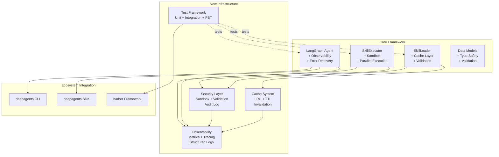

# Design Document: Skills Agent Comprehensive Improvements

## Overview

This design addresses critical gaps in the skills_agent framework across testing, security, observability, type safety, error handling, performance, and ecosystem integration. The current implementation lacks comprehensive test coverage (only 1 integration test), has security vulnerabilities in script execution and file operations, missing observability infrastructure, incomplete type hints, and performance bottlenecks in skill loading and reference searching. This design provides a systematic approach to transform skills_agent into a production-ready, secure, and performant framework that integrates seamlessly with the Deep Agents ecosystem.

The improvements are organized into 8 major areas: (1) Testing Infrastructure - comprehensive unit/integration/property-based tests, (2) Security Hardening - sandboxing, input validation, audit logging, (3) Observability Integration - structured logging, metrics, tracing, (4) Type Safety - complete type hints and protocol definitions, (5) Error Handling - refined exceptions and recovery strategies, (6) Performance Optimization - caching, parallel execution, optimized search, (7) Code Quality - refactoring and documentation, (8) Ecosystem Integration - deepagents SDK, harbor, CLI integration.

## Architecture

## Components

### 1. Testing Infrastructure
- **Unit Test Suite**: Comprehensive tests for SkillLoader, SkillExecutor, data models, and utilities
- **Integration Test Suite**: End-to-end tests for skill execution workflows
- **Property-Based Test Suite**: Universal correctness properties validated across random inputs
- **Test Fixtures**: Reusable test skills, configurations, and mock environments

### 2. Security Layer
- **Sandbox**: Isolated execution environment with resource limits and access controls
- **Input Validator**: Schema-based validation for skill metadata and parameters
- **Path Validator**: Normalization and traversal protection for file paths
- **Audit Logger**: Structured logging of security-relevant events

### 3. Observability Infrastructure
- **Structured Logger**: JSON-formatted logging with correlation IDs
- **Metrics Collector**: Performance and operational metrics (Prometheus/StatsD compatible)
- **Trace Provider**: OpenTelemetry-based distributed tracing
- **Correlation Context**: Request tracing across component boundaries

### 4. Type Safety
- **Type Annotations**: Complete type hints for all functions and classes
- **Protocol Definitions**: Structural typing for extensibility points
- **Type Validation**: Runtime validation of typed structures

### 5. Error Handling
- **Exception Hierarchy**: Specific exception classes for different error categories
- **Retry Manager**: Configurable retry policies with exponential backoff
- **Error Context**: Rich contextual information in exceptions

### 6. Performance Optimization
- **Cache System**: LRU cache with TTL for loaded skills
- **Parallel Executor**: Concurrent skill execution with dependency management
- **Search Index**: Inverted index for fast reference lookup

### 7. Ecosystem Integration
- **SDK Adapter**: Integration with Deep Agents SDK logging, config, and tracing
- **Harbor Benchmarks**: Performance and correctness benchmarks
- **CLI Commands**: Interactive skill management and execution

## Implementation Details

### Sandbox Implementation
The sandbox uses Python's `subprocess` with restricted permissions, resource limits via `resource` module, and filesystem access control via path validation. Network access is controlled through environment variables and socket restrictions.

### Cache Implementation
LRU cache with TTL using `functools.lru_cache` wrapper with time-based invalidation. Cache keys are based on skill path and modification time for automatic invalidation on file changes.

### Parallel Execution
Uses `asyncio` for concurrent skill execution with dependency graph analysis. Dependencies are extracted from skill metadata and execution order is determined via topological sort.

### Search Index
Inverted index maps references to skills. Built during initial loading and updated incrementally. Fuzzy matching uses Levenshtein distance with configurable threshold.

## Correctness Properties

*A property is a characteristic or behavior that should hold true across all valid executions of a system—essentially, a formal statement about what the system should do. Properties serve as the bridge between human-readable specifications and machine-verifiable correctness guarantees.*

### Property 1: Sandbox Isolation

*For any* skill execution, the skill should not be able to access resources outside the explicitly allowed sandbox boundaries (filesystem, network, system resources).

**Validates: Requirements 2.1, 2.2, 2.3**

### Property 2: Resource Limit Enforcement

*For any* skill that exceeds configured resource limits (CPU time, memory, file descriptors), the sandbox should terminate execution and log the violation.

**Validates: Requirements 2.4, 2.5**

### Property 3: Metadata Validation Rejection

*For any* skill metadata that violates the defined schema, the SkillLoader should reject loading and return a descriptive validation error.

**Validates: Requirements 3.1, 3.4**

### Property 4: Parameter Type Validation

*For any* skill execution with parameters that don't match the skill's type signature, the SkillExecutor should reject execution and return a type error.

**Validates: Requirements 3.2, 3.4**

### Property 5: Command Injection Prevention

*For any* string input containing shell metacharacters or injection sequences, the Skills_Agent should sanitize the input before use in any command execution context.

**Validates: Requirements 3.3**

### Property 6: Path Traversal Prevention

*For any* file path containing traversal sequences (../, ..\) or pointing outside allowed directories, the Skills_Agent should reject the path and log the violation.

**Validates: Requirements 3.5, 4.1, 4.2, 4.4**

### Property 7: Symbolic Link Validation

*For any* symbolic link accessed by a skill, the Skills_Agent should resolve the link and validate that the final target path is within allowed boundaries.

**Validates: Requirements 4.5**

### Property 8: Skill Execution Audit Logging

*For any* skill execution, the Audit_Log should contain an entry with timestamp, skill name, user context, parameters, and outcome.

**Validates: Requirements 5.1**

### Property 9: Security Violation Logging

*For any* security violation (unauthorized access, validation failure, resource limit exceeded), the Audit_Log should contain an entry with full context including attempted action, blocked reason, and stack trace.

**Validates: Requirements 5.2**

### Property 10: File Access Logging

*For any* file access operation performed by a skill, the Audit_Log should contain an entry with file path, access mode, and outcome.

**Validates: Requirements 5.3**

### Property 11: Structured Log Format

*For any* log message generated by the Skills_Agent, the message should be valid JSON containing standard fields (timestamp, level, component, message, context, correlation_id).

**Validates: Requirements 5.4, 6.1, 6.2, 5.5, 6.4**

### Property 12: Log Level Filtering

*For any* configured log level, only log messages at that level or higher severity should be emitted.

**Validates: Requirements 6.3**

### Property 13: Metrics Collection Completeness

*For any* skill operation (loading, execution, cache access, validation), the Skills_Agent should collect and expose corresponding metrics with operation name, duration, and outcome.

**Validates: Requirements 7.1, 7.2, 7.3, 7.4, 13.5, 14.5**

### Property 14: Trace Span Creation

*For any* skill execution, the Skills_Agent should create a trace span with unique span ID, skill name, parameters, execution time, and outcome.

**Validates: Requirements 8.1, 8.3**

### Property 15: Trace Context Propagation

*For any* skill execution that crosses component boundaries (loader → executor → graph), the trace context should be propagated and parent-child span relationships should be maintained.

**Validates: Requirements 8.2**

### Property 16: Error Trace Recording

*For any* error that occurs during skill execution, the error should be recorded in the trace span with error type, message, and stack trace.

**Validates: Requirements 8.5**

### Property 17: Specific Exception Types

*For any* error condition, the Skills_Agent should raise the most specific exception type (SkillLoadError, SkillExecutionError, ValidationError, SecurityError) rather than generic exceptions.

**Validates: Requirements 11.3**

### Property 18: Exception Context Preservation

*For any* exception raised by the Skills_Agent, the exception message should include contextual information (skill name, operation, parameters) and exception chaining should preserve the original error.

**Validates: Requirements 11.4, 11.5**

### Property 19: Transient Error Retry

*For any* skill execution that fails with a transient error (network timeout, temporary resource unavailability), the Skills_Agent should retry with exponential backoff according to the configured retry policy.

**Validates: Requirements 12.1, 12.2**

### Property 20: Retry Exhaustion Error

*For any* skill execution where retries are exhausted, the Skills_Agent should raise the final error with retry context (number of attempts, backoff intervals, final failure reason).

**Validates: Requirements 12.3**

### Property 21: Error Classification

*For any* error raised during skill execution, the Skills_Agent should correctly classify it as retryable or non-retryable based on error type and context.

**Validates: Requirements 12.4**

### Property 22: Retry Attempt Logging

*For any* retry attempt, the Skills_Agent should log the attempt with context (attempt number, backoff delay, error that triggered retry).

**Validates: Requirements 12.5**

### Property 23: Cache LRU Eviction

*For any* sequence of skill loads that exceeds the cache size, the cache should evict the least recently used entries to maintain the size limit.

**Validates: Requirements 13.1**

### Property 24: Cache TTL Expiration

*For any* cached skill entry, if the TTL expires, the next access should reload the skill from disk rather than using the cached version.

**Validates: Requirements 13.2**

### Property 25: Cache Lookup Before Load

*For any* skill load request, the SkillLoader should check the cache first, and only load from disk on cache miss.

**Validates: Requirements 13.3**

### Property 26: Cache Invalidation

*For any* cache invalidation request (specific skill or all skills), the cache should remove the specified entries and subsequent loads should reload from disk.

**Validates: Requirements 13.4**

### Property 27: Parallel Independent Execution

*For any* set of independent skills (no dependencies between them), the SkillExecutor should execute them in parallel up to the configured parallelism limit.

**Validates: Requirements 14.1, 14.3**

### Property 28: Sequential Dependent Execution

*For any* set of skills with dependencies, the SkillExecutor should execute dependent skills sequentially in dependency order.

**Validates: Requirements 14.2**

### Property 29: Parallel Error Isolation

*For any* parallel skill execution where one skill fails, the failure should not affect the execution of other independent skills.

**Validates: Requirements 14.4**

### Property 30: Fuzzy Reference Search

*For any* reference search query, the SkillLoader should return skills whose references match the query within the configured similarity threshold using fuzzy matching.

**Validates: Requirements 15.3**

### Property 31: Search Result Caching

*For any* repeated reference search query, the SkillLoader should return cached results without re-executing the search.

**Validates: Requirements 15.4**

### Property 32: Incremental Index Update

*For any* skill addition or modification, the SkillLoader should update the search index incrementally without rebuilding the entire index.

**Validates: Requirements 15.5**

### Property 33: SDK Tool Compatibility

*For any* skill exposed through the Deep Agents SDK interface, the skill should be callable as a tool with parameters matching the skill's signature.

**Validates: Requirements 18.3**

## Testing Strategy

### Unit Tests
- Test individual components in isolation (SkillLoader, SkillExecutor, Cache, Sandbox, Validators)
- Mock external dependencies (filesystem, network, subprocess)
- Focus on specific examples and edge cases
- Target: 80%+ code coverage

### Integration Tests
- Test end-to-end workflows (load skill → validate → execute → log → collect metrics)
- Use real filesystem and subprocess execution
- Test ecosystem integration (SDK, harbor, CLI)
- Focus on component interactions and data flow

### Property-Based Tests
- Validate universal properties across randomly generated inputs
- Minimum 100 iterations per property test
- Use hypothesis library for Python
- Tag format: **Feature: skills-agent-comprehensive-improvements, Property {number}: {property_text}**
- Focus on security properties (sandbox, validation, path traversal)
- Focus on correctness properties (caching, retry, parallel execution)

### Performance Benchmarks
- Measure skill loading time (cold and cached)
- Measure skill execution time (sequential and parallel)
- Measure search performance (index build and query)
- Use harbor framework for benchmark execution and reporting

## Migration Strategy

### Phase 1: Foundation (Week 1-2)
1. Add type hints to existing code
2. Implement exception hierarchy
3. Add structured logging infrastructure
4. Create test fixtures and utilities

### Phase 2: Security (Week 3-4)
1. Implement sandbox with resource limits
2. Add input validation and path protection
3. Implement audit logging
4. Add security property tests

### Phase 3: Observability (Week 5-6)
1. Integrate metrics collection
2. Add distributed tracing
3. Implement correlation context
4. Add observability tests

### Phase 4: Performance (Week 7-8)
1. Implement caching system
2. Add parallel execution
3. Build search index
4. Add performance benchmarks

### Phase 5: Integration (Week 9-10)
1. Integrate with Deep Agents SDK
2. Create harbor benchmarks
3. Add CLI commands
4. Final integration testing

## Risks and Mitigations

### Risk: Sandbox Escape
**Mitigation**: Use multiple layers of defense (subprocess isolation, resource limits, path validation). Regular security audits and penetration testing.

### Risk: Performance Regression
**Mitigation**: Establish performance baselines before changes. Run benchmarks in CI. Use caching and parallel execution to offset validation overhead.

### Risk: Breaking Changes
**Mitigation**: Maintain backward compatibility for public APIs. Use deprecation warnings for API changes. Comprehensive integration tests.

### Risk: Complexity Increase
**Mitigation**: Incremental rollout with feature flags. Comprehensive documentation. Code review focus on maintainability.
