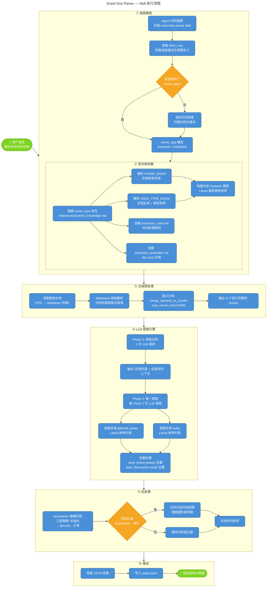

# 大型活动方案解析SKILL

两张流程图的定位：
图1 skill_execution_flow.mermaid — Skill 执行全景视图，6 个阶段：

技能触发（意图识别 → scene_type 确定）
知识库加载（枚举解析 → 动态模型构建）
文档预处理（PDF转换 → 语义分块）
LLM 提取引擎（Phase 1 结构识别 → Phase 2 统一提取）
后处理（boundaries 模糊匹配 → 区域合并）
输出 JSON

图2 doc_parser_detail_flow.mermaid — 文档解析内部机制详图，展开每个关键节点：

_init_dynamic_models 的 Literal 类型生成链路
语义分块的超长 section 处理分支
Phase 2 循环内的 instructor retry 机制（Pydantic 校验失败 → 错误回传 LLM → 重试）
boundaries 模糊匹配的三层递进策略（标准化 → Jaccard → 子串包含）
_do_merge 的合并逻辑细节

## Skill 执行全景视图

## 文档解析内部机制详图

```mermaid
---
title: Event Doc Parser — 文档解析详细流程
---
flowchart TB
    %% ===== 输入 =====
    INPUT([📄 输入: 活动文档 + scene_type + event_date])
    INPUT --> INIT

    %% ===== 初始化 =====
    subgraph INIT["初始化 EventDocExtractor"]
        direction TB
        I1["加载知识库<br/>references/{scene}_knowledge.md"]
        I1 --> I2["_parse_knowledge_enums()"]

        I2 --> I2A["正则提取 PHASE_ENUM<br/>→ phases_enum 列表"]
        I2 --> I2B["正则提取 AREA_TYPE_ENUM<br/>→ area_names + area_types"]

        I2A & I2B --> I3{"area_names<br/>非空?"}
        I3 -- "是 (跨年夜)" --> I4["has_strict_area_names = True<br/>area_name 用 Literal 锁死"]
        I3 -- "否 (马拉松)" --> I5["has_strict_area_names = False<br/>area_name 退化为 str"]

        I4 & I5 --> I6["_init_dynamic_models()<br/>create_model() 生成"]

        I6 --> I6A["DynAreaItem<br/>area_name: Literal / str<br/>type: Literal<br/>phase: Literal"]
        I6 --> I6B["DynTaskItem<br/>phase: Literal<br/>affected_area: Literal / str"]
        I6A & I6B --> I6C["DynChunkOutput<br/>= areas + tasks 联合模型"]

        I1 --> I7["加载 extraction_rules.md"]
        I1 --> I8["加载 extraction_examples.md"]
        I7 & I8 --> I9["_build_compact_knowledge()<br/>精简枚举摘要 ~500 chars"]
    end

    INIT --> PHASE1

    %% ===== Phase 1 =====
    subgraph PHASE1["Phase 1: 文档结构识别"]
        direction TB
        P1A{"文档 > 5000 字?"}
        P1A -- 是 --> P1B["截取摘要<br/>前 4000 + 后 1000 字"]
        P1A -- 否 --> P1C["使用全文"]

        P1B & P1C --> P1D["构建 system_prompt<br/>注入 phases_enum"]
        P1D --> P1E["🤖 LLM 调用 #1<br/>response_model = PhaseDetectionOutput"]
        P1E --> P1F["输出:<br/>phases_detected 列表<br/>global_time_context"]
    end

    PHASE1 --> CHUNK

    %% ===== 语义分块 =====
    subgraph CHUNK["语义分块"]
        direction TB
        C1["parse_document_structure(text)"]
        C1 --> C1A["识别 Markdown 标题<br/>## / ### / #### 层级"]
        C1 --> C1B["识别中文编号<br/>一、/ (一) / 1."]
        C1A & C1B --> C2["DocumentSection 列表<br/>heading + content + level"]

        C2 --> C3["merge_sections_to_chunks()<br/>max_chunk_chars = 6000"]

        C3 --> C3A{"section 超长?"}
        C3A -- 是 --> C3B["按段落 \\n\\n 切分<br/>添加上下文标题"]
        C3A -- 否 --> C3C["合并相邻小 section"]
        C3B & C3C --> C4["输出 N 个 chunks<br/>(每个 ≤ 6000 chars)"]
    end

    CHUNK --> PHASE2

    %% ===== Phase 2 =====
    subgraph PHASE2["Phase 2: 统一提取 (区域 + 任务)"]
        direction TB
        P2A["构建 base_system_prompt<br/>注入: 枚举约束 + 阶段结构<br/>+ compact_knowledge + 时间规则"]

        P2A --> LOOP

        subgraph LOOP["遍历 chunks"]
            direction TB
            L1["chunk i"]
            L1 --> L2{"有上文<br/>时间锚点?"}
            L2 -- 是 --> L3["追加时间锚点到 prompt"]
            L2 -- 否 --> L4["使用 base prompt"]
            L3 & L4 --> L5["组装 messages<br/>system + few-shot + user"]
            L5 --> L6["🤖 LLM 调用 #i+1<br/>response_model = DynChunkOutput"]

            L6 --> L7["Pydantic 校验"]
            L7 --> L7A{"校验通过?"}
            L7A -- 否 --> L7B["instructor retry<br/>(max_retries=3)<br/>返回错误给 LLM 修正"]
            L7B --> L6
            L7A -- 是 --> L8["提取 areas + tasks"]

            L8 --> L9["区域去重<br/>key = (area_name, phase)"]
            L8 --> L10["任务去重<br/>key = (time, action, area)"]
            L9 --> L11["补全: boundaries / time 信息"]
            L10 --> L12["更新时间锚点<br/>last_context_time"]
        end
    end

    PHASE2 --> MERGE

    %% ===== 区域合并 =====
    subgraph MERGE["后处理: 区域合并"]
        direction TB
        M1["按 area_name 分组"]
        M1 --> M2{"单条记录?"}
        M2 -- 是 --> M3["直接保留"]
        M2 -- 否 --> M4["_boundaries_are_similar()"]

        M4 --> M4A["层1: 标准化比较<br/>全角→半角, 去噪声词"]
        M4A --> M4B{"相等?"}
        M4B -- 是 --> M6["判定: 一致 ✓"]
        M4B -- 否 --> M4C["层2: 路名集合提取<br/>正则匹配 XX路/大道/桥/隧道"]
        M4C --> M4D["层3: Jaccard 相似度"]
        M4D --> M4E{"≥ 0.75?"}
        M4E -- 是 --> M6
        M4E -- 否 --> M7["判定: 不一致 ✗"]

        M6 --> M8["_do_merge()<br/>合并为 phase=全时段保障<br/>措施按阶段拼接: 【阶段】措施<br/>boundaries 取最长"]
        M7 --> M9["保持分阶段记录"]
    end

    MERGE --> RESULT

    %% ===== 输出组装 =====
    subgraph RESULT["输出组装"]
        direction TB
        R1["tasks 按 start_time 排序"]
        R1 --> R2["组装 JSON"]
        R2 --> R2A["event_type: scene_type"]
        R2 --> R2B["affected_areas: 合并后区域"]
        R2 --> R2C["tasks: 排序后任务"]
        R2A & R2B & R2C --> R3["写入 output.json"]
    end

    RESULT --> DONE([🏁 输出: 结构化 JSON])

    %% ===== 性能标注 =====
    PERF["⚡ 性能: 1 + N 次 LLM 调用<br/>(N = chunk 数, 通常 2~3)"]

    %% ===== 样式 =====
    classDef phase fill:#4A90D9,stroke:#2C5F8A,color:#fff,rx:6
    classDef decision fill:#F5A623,stroke:#D48A1C,color:#fff
    classDef io fill:#7ED321,stroke:#5CA018,color:#fff,rx:12
    classDef llm fill:#9B59B6,stroke:#7D3C98,color:#fff,rx:6
    classDef perf fill:#E74C3C,stroke:#C0392B,color:#fff,rx:6

    class I1,I2,I2A,I2B,I4,I5,I6,I6A,I6B,I6C,I7,I8,I9 phase
    class P1B,P1C,P1D,P1F phase
    class C1,C1A,C1B,C2,C3,C3B,C3C,C4 phase
    class P2A,L1,L3,L4,L5,L7,L8,L9,L10,L11,L12 phase
    class M1,M3,M4,M4A,M4C,M4D,M6,M7,M8,M9 phase
    class R1,R2,R2A,R2B,R2C,R3 phase

    class I3,P1A,C3A,L2,L7A,M2,M4B,M4E decision
    class INPUT,DONE io
    class P1E,L6,L7B llm
    class PERF perf
```

